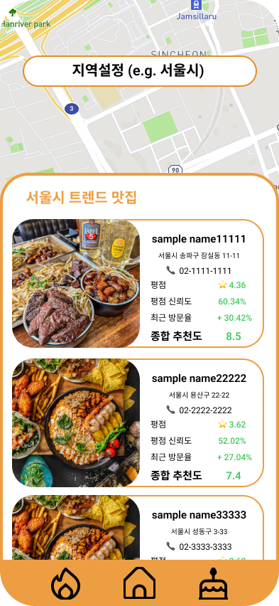
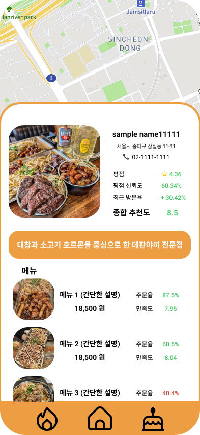

# amu

## 1️⃣ Overview

Flutter + Python을 사용한 AI 맛집 추천 앱입니다.

- 네이버 지도 API를 활용한 맛집 검색
- AI를 통한 리뷰 분석 및 평점 조작 탐지를 실시하고, 최근 등록된 리뷰, 예약 등을 분석해 인기가 급상승한 식당 추천.

## 2️⃣ Skills

### Frontend

<div style="display: flex; gap: 10px;">


</div>

### Backend

<div style="display: flex; gap: 10px;">


</div>

### AI 모델

KoBERT, Scikit-learn

## 3️⃣ Launch

### Frontend

```zsh
cd frontend

flutter pub get

flutter run
```

### Backend

```zsh
cd backend

# 가상환경 설치
python3.12 -m venv venv

# mac
source venv/bin/activate
# window
venv\Scripts\activate

# 의존성 설치
pip install -r requirements.txt

# 서버 실행
uvicorn main:app --reload

# 가상환경 종료
deactivate
```

## 4️⃣ Screens

### 홈

|                     화면                      |                                                                                             설명                                                                                              |
| :-------------------------------------------: | :-------------------------------------------------------------------------------------------------------------------------------------------------------------------------------------------: |
|             |                             **메인 홈 화면**<br/><br/>사용자 현재 위치 기반의 지도, 검색창 노출<br/> 하단 메뉴 클릭시 각각 트렌드 맛집, 홈, 카테고리 맛집 ui 노출                             |
|  |                                                        상세보기 클릭시 표시되는 ui.<br/>메뉴 종류를 선택후, 가게 리스트 화면으로 이동                                                         |
|   | **매장 세부 정보**<br/><br/>음식 카테고리에 따른 매장 리스트 노출.<br/> 매장 이름, 위치, 평점, 평점신뢰도, 종합 추천도 표시.<br/>길게 클릭시 매장과 전화 연결, 짧게 클릭시 가게 상세화면 이동 |

### 트렌드 맛집

|                 화면                  |                                                   설명                                                   |
| :-----------------------------------: | :------------------------------------------------------------------------------------------------------: |
|  | 하단 네비게이션 왼쪽 버튼 클릭시 표시되는 화면.<br/>설정 된 지역(시 기준)내 방문율을 기준으로 식당 표시. |

### 카테고리별 맛집

|                       화면                        |                                                                            설명                                                                            |
| :-----------------------------------------------: | :--------------------------------------------------------------------------------------------------------------------------------------------------------: |
|  | 하단 네비게이션 오른쪽 버튼 클릭시 표시되는 화면.<br/>입력한 지역 기반, 특정 테마별로 분류해서 맛집을 추천.<br/>카테고리 클릭시 가게 리스트 화면으로 이동. |

### 음식점 상세

|                     화면                     |                                        설명                                        |
| :------------------------------------------: | :--------------------------------------------------------------------------------: |
|  | 가게 요약 정보 및 상세 정보 표시.<br/>리뷰 분석을 통한 메뉴 주문율, 만족도를 표시. |
